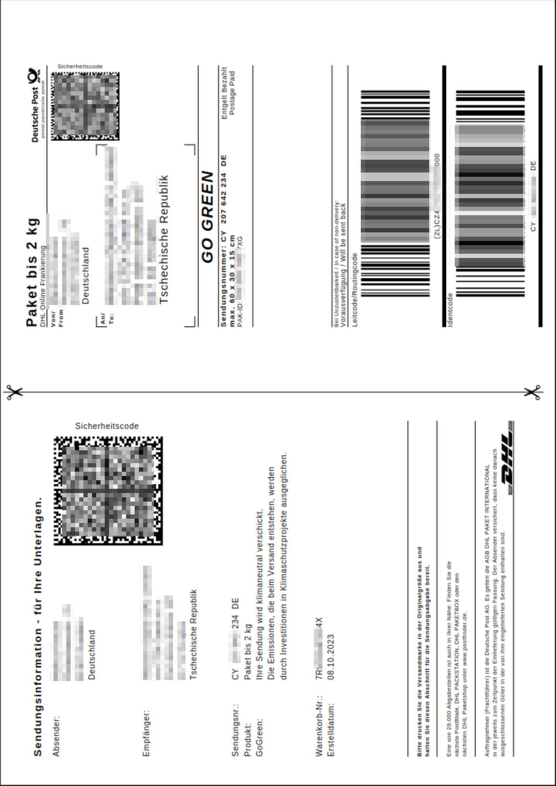
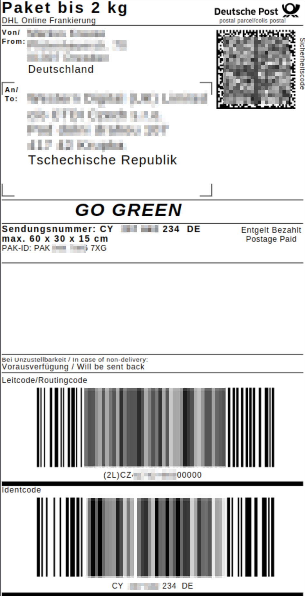
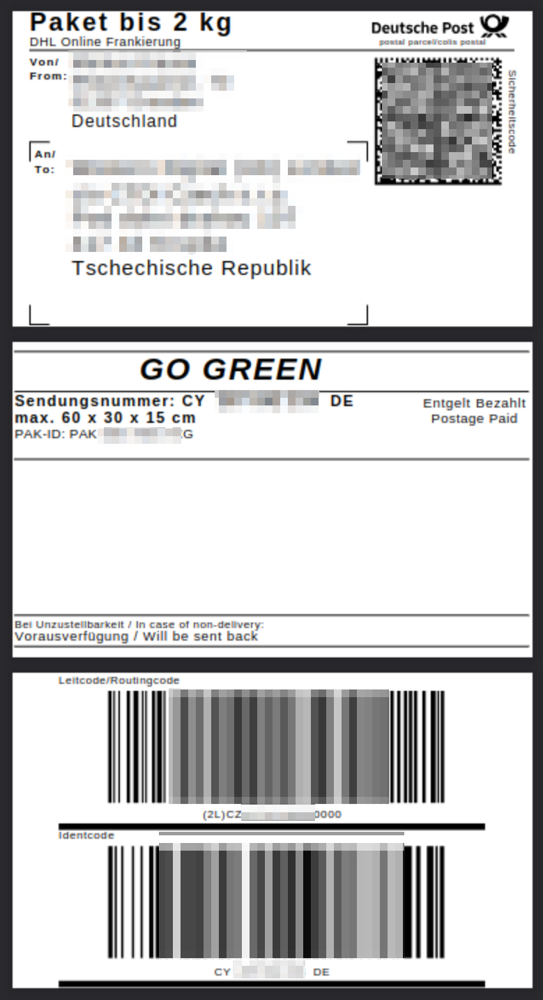

# labelcutter - making shipping labels printable

If you like this, a small donation is appreciated:

**HELP WANTED:** If you want support for more label types, I need *ORIGINAL* PDFs or image files like they come from the shipping provider, screenshots won't work. And a description how they should be transformed (just cropped, or e.g. sliced for 62mm endless labels like the example below). Send them to mkddsx@gmail.com and open an issue here.

We all know the annoying habit of shipping providers to only give you an A4 or US-Letter page as a shipping label.

This program aims to change that with a simple CLI call. Locally, on your computer, no need to upload your labels to a foreign webpage where you don't know what happens there with your information.

**NOTE:**
This is an early version with support for typical A4-sized DHL label PDFs. I plan to extend that,
but I need example labels. (Hermes, UPS, GLS, FedEx, TNT, 'Retour'-Labels, whatever you need)

**FAQ:**

- how to install: currently just clone the repo and make sure a recent Python3 and pikepdf is installed (either `pip install pikepdf` or on your Linux distro there might be an OS package available)
- how to use: see examples below, there is also CLI help via the `-h` or `--help` switch
- which platform: this should work everywhere where Python and pikepdf can run, so Windows, Linux and MacOS should all be fine

**TODO:**

- add support for more labels and formats (if needed)
- make outfilename configurable
- code refactor: define a container per input label type that describes the needed transformations

**Examples:**

Example below, converted via: `python labelcutter.py --type DHL_A4 example_DHL_A4.pdf`

| Original (Example: DHL Germany on A4) | Label only extracted by labelcutter for proper 103x199mm DHL Labels |
|---|---|
|  |  |

Many people also have Brother 62mm endless label printers, for them, there is a format conversion:

`python labelcutter.py -t DHL_A4 --format Brother_62mm assets/example_DHL_A4.pdf`

| Original (Example: DHL Germany on A4) | Label only extracted by labelcutter for Brother 62mm endless labels (print all 3 'pages', seperate and attach top to bottom to form the original label) |
|---|---|
|  |  |